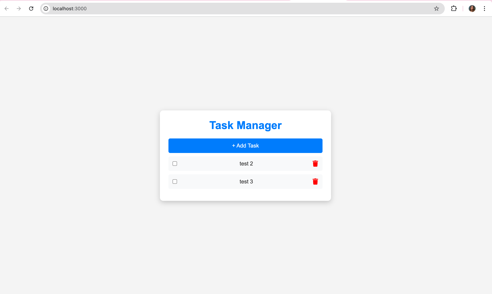
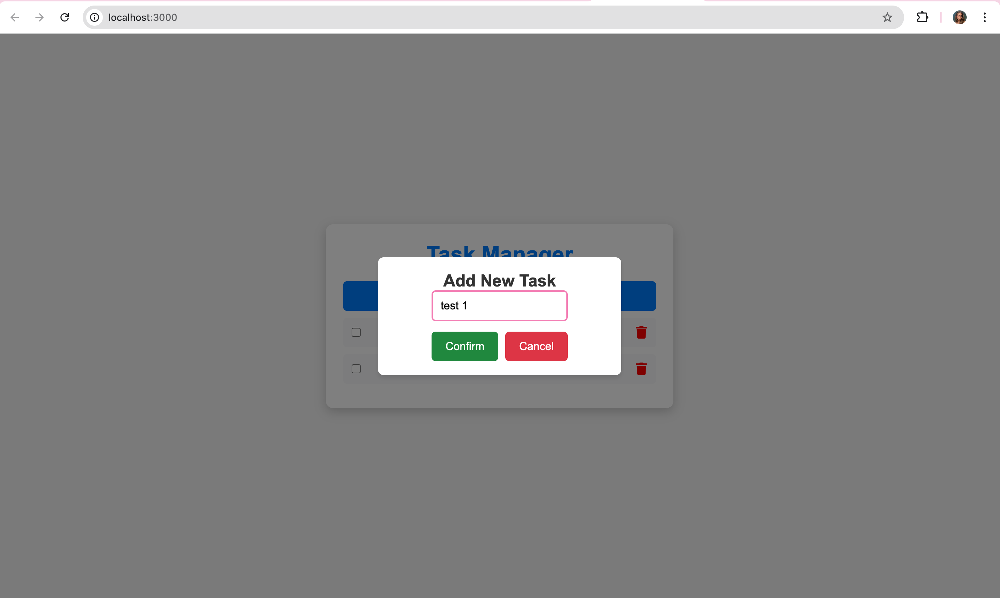
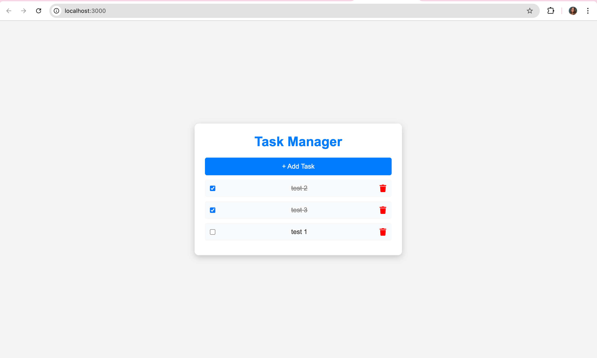
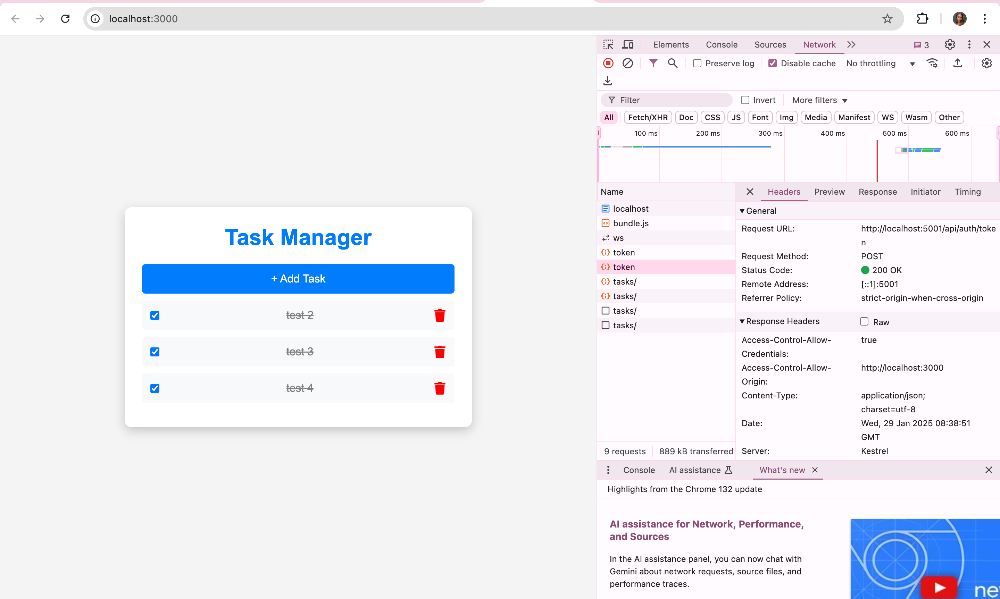
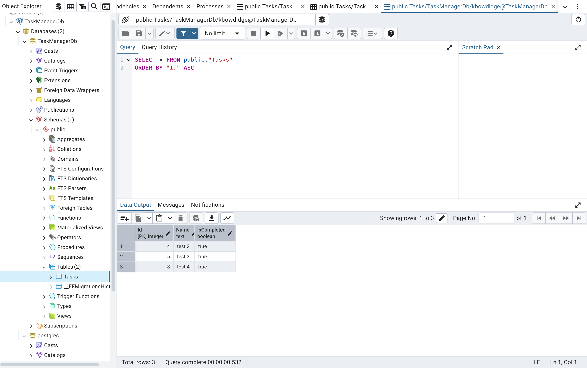

## 📝 Task Manager 

A full-stack task management application built with React (Frontend) and .NET (Backend) using PostgreSQL as the database and JWT authentication for securing API requests. The app allows users to create, view, complete, and delete tasks with a clean and responsive UI.

## 📌 Features 

- Add Tasks – Users can create new tasks via a pop-up modal. 
- View Tasks – Displays a list of tasks.
- Mark Tasks as Completed – Checkbox to mark tasks as done (with strikethrough task name). 
- Delete Tasks – Remove a task with a trash icon button. 
- State Management – Uses Redux for state handling. 
-  Database Integration – Uses PostgreSQL with Entity Framework.
- CORS Enabled – Allows frontend-backend communication. 
- JWT Authentication - Secures API Requests

## 🚀 Getting Started 

1️. Clone the Repository 

git clone https://github.com/your-username/TaskManager.git \
cd TaskManager

### Frontend Setup 

2. Install Dependencies 

cd client \
npm install

3. Start the React App 

npm start

If you get an error for missing dependencies, install:

npm install react-icons axios @reduxjs/toolkit react-redux

### Backend Setup 

4. Navigate to Server Directory

cd server 

5. Install .NET Dependencies

dotnet restore 

6. Set Up PostgreSQL Database

Ensure PostgreSQL is running \
You can start PostgreSQL using:

brew services start postgresql \
Create the Database

psql -U postgres
CREATE DATABASE TaskManagerDb; 

7. Apply Migrations

dotnet ef database update 

8. Run the .NET Server

dotnet run

Backend will now run on:
http://localhost:5001

## 🔐 JWT Authentication

1. Update appsettings.json with JWT Settings 

Add the following to your appsettings.json: 

"JwtSettings": {
  "SecretKey": "your-very-secure-key",
  "Issuer": "your-app",
  "Audience": "your-audience"
}

Replace your-very-secure-key with a random 256-bit key.

## 🔗 API Endpoints

| Method | Endpoint         | Description              |
|--------|-----------------|--------------------------|
| GET    | `/api/tasks`     | Get all tasks           |
| POST   | `/api/tasks`     | Add a new task          |
| PUT    | `/api/tasks/{id}` | Mark a task as complete |
| DELETE | `/api/tasks/{id}` | Delete a task           |

## 📸 Screenshots

Landing Page 

 

Adding a Task 

 

Completing a Task 

Token 

DB (PgAdmin) 

